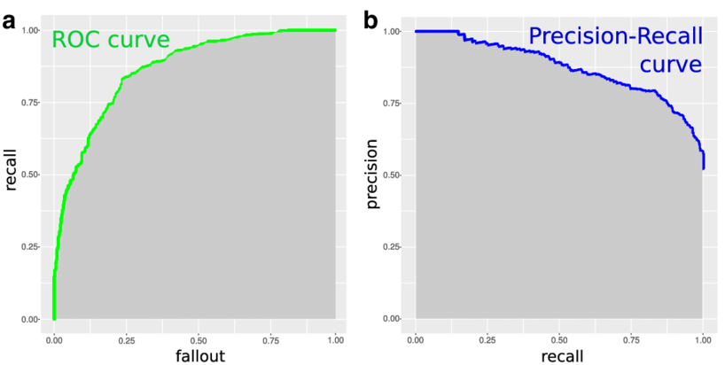
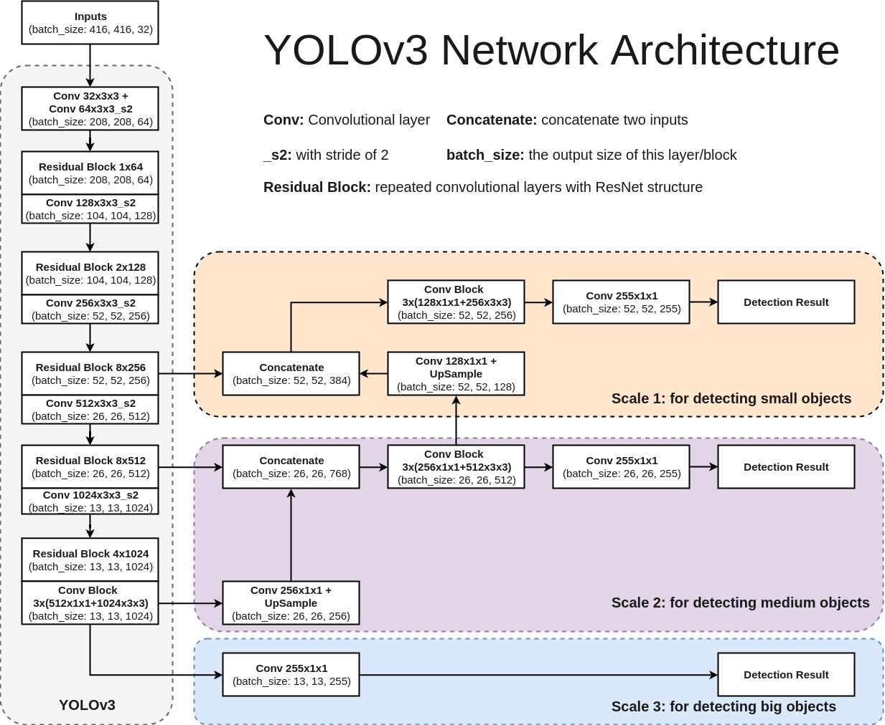
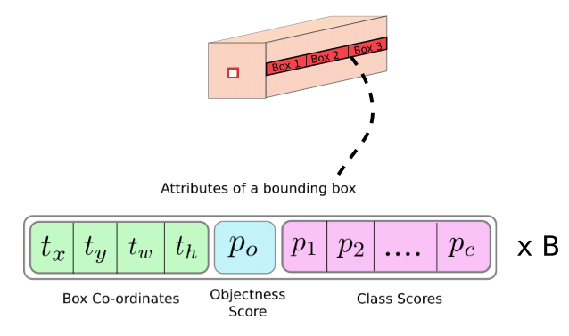
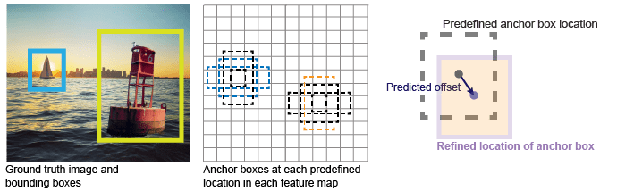
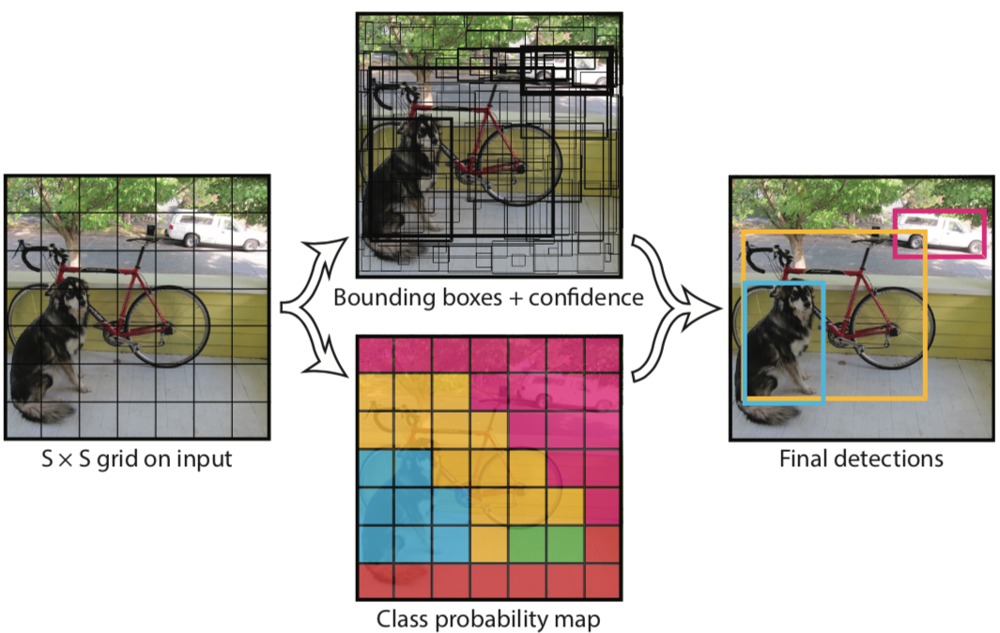

# YOLO (You Only Look Once)
- 256 x 256 사이즈 이미지
- Python, Tensorflow 기반 프레임워크가 아닌 C++로 구현된 코드 기준 GPU 사용시, 170 FPS(Frames Per Second)
- 작은 크기 물체 탐지는 어려움

## YOLOv5 (2020)
- YOLOv4에 비해 낮은 용량과 빠른 속도 (성능은 비슷)
- YOLOv4와 같은 CSPNet 기반의 backbone을 설계하여 사용
- YOLOv3를 PyTorch로 implementation한 Glenn Jocher가 발표
- Darknet이 아닌 PyTorch 구현이기 때문에, 이전 버전들과 다르다고 할 수 있음

## 사전 지식

### bounding box
- 이미지에서 하나의 객체 전체를 포함하는 가장 작은 직사각형

### confidence
- 예측 클래스의 신뢰도

### IOU (Intersection Over Union)
- 실측값(Ground Truth)과 모델이 예측한 값이 얼마나 겹치는지를 나타내는 지표

### NMS (Non-Maximum Suppression, 비최댓값 억제)
- 확률이 가장 높은 상자와 겹치는 상자들을 제거하는 과정
- 최댓값을 갖지 않는 상자들을 제거

### Precision(정밀도), Recall(재현율)
- TP (True Positives) : True로 예측한 것이 실제 True인지 측정
- FP (False Positives, 거짓긍정) : False로 예측한 것이 실제 False인지 측정
- TN (True Negatives) : True로 예측했지만 False인지 측정
- FN (False Negatives) : False로 예측했지만 True인지 측정

 

- 안정적이지 않은 특징으로 객체를 예측하면 → FP 증가 → Presion(정밀도) 낮아짐
- 너무 엄격한 조건으로 객체를 예측하면 → FN 증가 → Recall(재현율) 낮아짐

### Precision-Recall Curve (PR Curve, 정밀도-재현율 곡선)
- 임계값 T 이하의 예측은 제거
- T가 1에 가까우면 (= 신뢰도 높은 예측만 유지) precision은 높지만, recall은 낮음
- T가 0에 가까우면 (= 대부분의 예측을 유지 = FP 증가) precision은 낮지만, recall은 높음

### AP (Average Precision, 평균 정밀도)
- PR Curve 아래 영역에 해당
- 단일 클래스에 대한 모델 성능 정보를 제공

### mAP (mean Average Precision)
- 전역 점수를 얻기 위해 사용
- 각 클래스에 대한 AP 계산하고, 그 평균을 구함

## YOLO architecture

## YOLO 계층 출력
- 마지막 계층 출력은 $w \times h \times M$ 행렬
  - B : 그리드 셀당 bounding box 개수
  - C : 클래스 개수

$$M = B \times ( C + 5 )$$

- 클래스 개수에 5를 더한 이유 (예측이 더 필요한 이유)
  - $t_x$ , $t_y$ : bounding box의 중심 좌표
  - $t_w$ , $t_h$ : bounding box의 너비와 높이
  - $c$ : 객체가 bounding box 안에 있다고 확신하는 신뢰도 (Objectness Score)

## Anchor Box (앵커 박스)
- 사전 정의된 상자(prior box)
- 객체에 가장 근접한 Anchor Box를 맞추고 신경망을 사용해 크기를 조정하는 과정 때문에 $t_x$ , $t_y$ , $t_w$ , $t_h$ 필요

