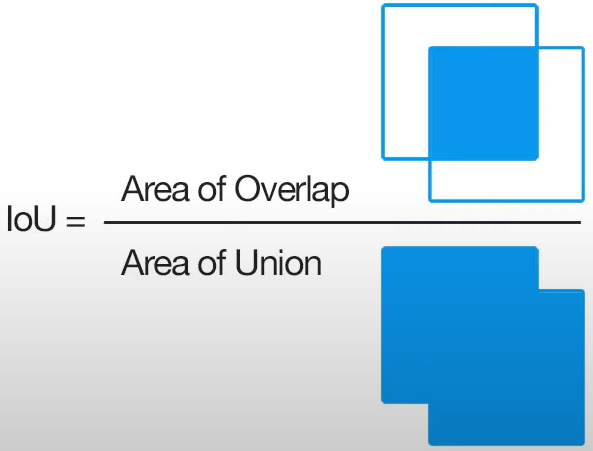
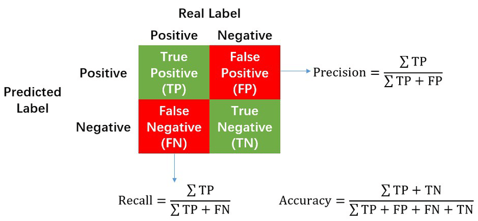

# YOLOv5
YOLOv5 study

## bounding box
- 이미지에서 하나의 객체 전체를 포함하는 가장 작은 직사각형

## confidence
- 예측 클래스의 신뢰도

## IOU (Intersection Over Union)
- 실측값(Ground Truth)과 모델이 예측한 값이 얼마나 겹치는지를 나타내는 지표

## NMS (Non-Maximum Suppression, 비최댓값 억제)
- 확률이 가장 높은 상자와 겹치는 상자들을 제거하는 과정
- 최댓값을 갖지 않는 상자들을 제거

## Precision(정밀도), Recall(재현율)
- TP (True Positives) : True로 예측한 것이 실제 True인지 측정
- FP (False Positives) : False로 예측한 것이 실제 False인지 측정
- TN (True Negatives) : True로 예측했지만 False인지 측정
- FN (False Negatives) : False로 예측했지만 True인지 측정

 

- 안정적이지 않은 특징으로 객체를 예측하면 → FP 증가 → Presion(정밀도) 낮아짐
- 너무 엄격한 조건으로 객체를 예측하면 → FN 증가 → Recall(재현율) 낮아짐

## Precision-Recall Curve (정밀도-재현율 곡선)

  
